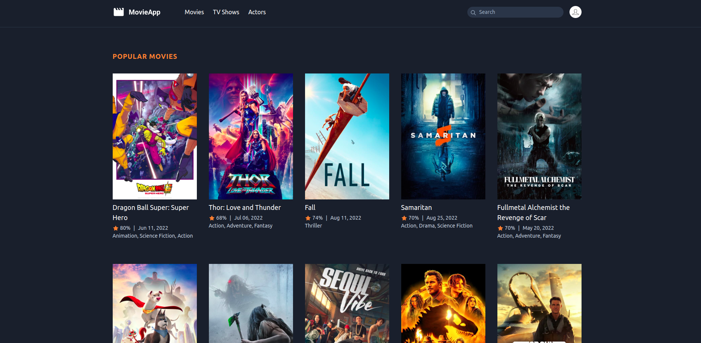

<h1>Laravel Movies App</h1>

<p align="center">
  
</p>

### Tópicos 

:small_blue_diamond: [Descrição do projeto](#descrição-do-projeto)

:small_blue_diamond: [Pré-requisitos](#pré-requisitos)

:small_blue_diamond: [Como rodar a aplicação](#como-rodar-a-aplicação)

:small_blue_diamond: [Referências](#referências)


## Descrição do projeto 

<p align="justify">
  Projeto de estudo front-end construído com a stack TALL

 - [TailwindCss](https://tailwindcss.com/)
 - [AlhpineJS](https://alpinejs.dev/)
 - [Laravel](https://laravel.com/)
 - [Livewire](https://laravel-livewire.com/)
</p>


## Pré-requisitos

:warning: [PHP 7.3](https://nodejs.org/en/download/) Instalado e configurado em sua maquina, via docker ou o que prefirir.

## Como rodar a aplicação

No terminal, clone o projeto: 

```
git clone https://github.com/filipeassuncao/laravel-movies-app.git
```
Se faz necessario o cadastro na api que disponibiliza os endpoints para consulta de um universo de dados sobre filmes, series, atores, etc. Link:
https://www.themoviedb.org/, entre faça o cadastro e vá em configurações, gere seu token para poder acessar os recursos da API.

Faça a copia do **.env.example** para um arquivo **.env** e prencha a variavel **TMDB_TOKEN** com o token gerado pela suas credencias no site referenciado acima.


Faça a instalação das depedências do composer pelo comando:

```
$ composer install
```

Para executar a aplicação basta rodar o comando:

```
$ php artisan serve
```

## Como rodar os testes

Entre na pasta raiz do projeto e rode o comando
```
$ php artisan test
```

## Referências

  Todo projeto foi resultado das aulas ministradas por Andre Madarang, onde o mesmo disponibiliza no seu canal do youTube diversos cursos gratuitos sobre tecnologia.
  Link para seu canal: https://www.youtube.com/c/drehimself

## Licença 

The [MIT License]() (MIT)

Copyright :copyright: 2022 - Laravel Movies App